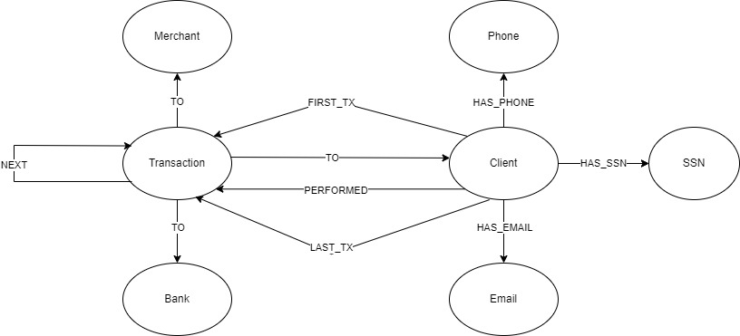

## CS343 Project: Financial Fraud Detection App

### Objective
In this project, we have made an application that displays graph analytics regarding a fraud detection dataset, by using Neo4j's Graph Data Science (GDS) library. The app also includes a trained machine learning model that can predict if a person is fraudulent or not.

### Team Members
- Syed Nisar Hussain
- Neil Lakhani

### Model
The labeled property graph model of the dataset used in this project:


### Setup
Create a Neo4j Database using Neo4j Desktop.

Load the data into this database using the given dump file: [fraud-detection-50.dump](data/fraud-detection-50.dump)

Once the dump file is added, start the database.

Now, to start the application. Firstly, create a virtual environment in Python. To learn more about this, visit this [link](https://docs.python.org/3/library/venv.html).

Once your virtual environment is activated, run the following command in your terminal to install the necessary libraries:
```
pip install -r requirements.txt
```

After all requirements are installed, go ahead and run the following command in the terminal to open the application:
```
streamlit run src/home.py
```

You can now connect to the database using the credentials that you used while making the Neo4j database, and view graph analytics or get predictions.

### Poster
The poster summarizing the entire project can be viewed here: [Poster](Poster.pdf)
### Enjoy!
